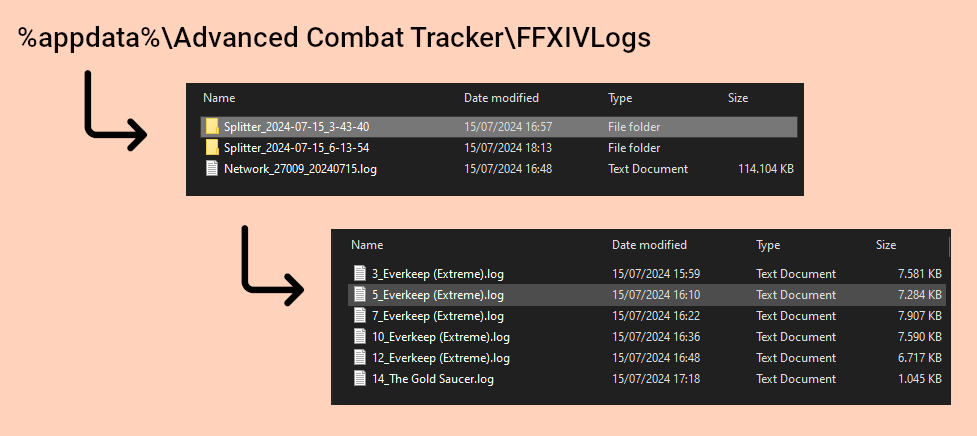

# ACT FFXIV Log Splitter
- Automatically split encounters to log files per zone, in real-time.
- Remove zones without encounters when changing to a new zone.

## Download
Download the latest DLL from the [Releases page](https://github.com/grievouz/FFXIVLogSplitter/releases) and load it as an ACT plugin.

## Example

## Contributing

Contributions to `ACT_FFXIV_LogSplitter` are welcome! Please open an issue or submit a pull request on the GitHub repository.

## License

`ACT_FFXIV_LogSplitter` is released under the [MIT License](./LICENSE.md).